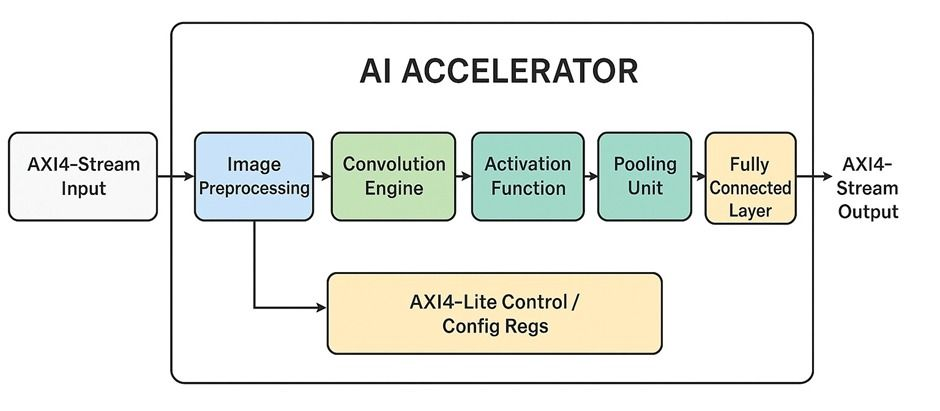
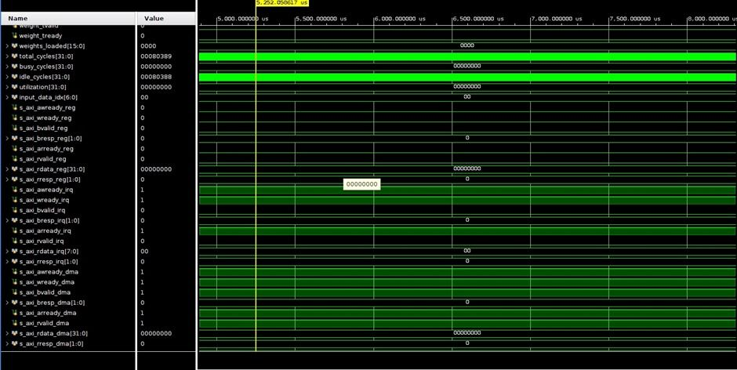
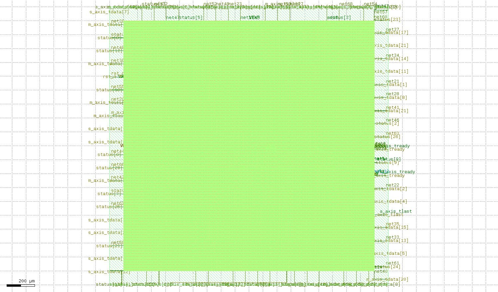
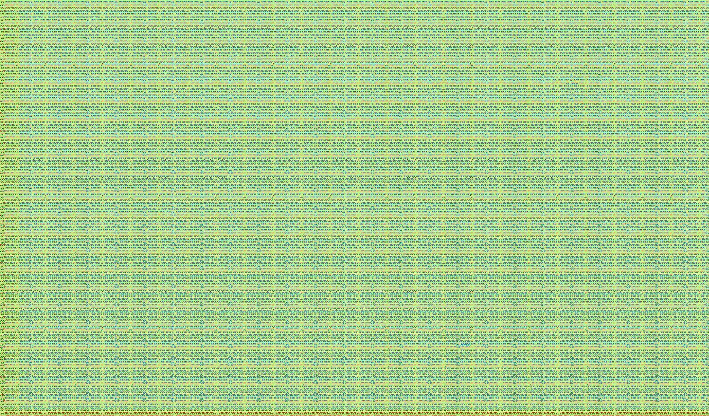

# 🚀 CNN Accelerator – RTL to GDSII (Sky130 OpenLane)

## 📌 Project Overview

This project implements a CNN-based hardware accelerator completely in SystemVerilog and takes it through a full RTL-to-GDSII ASIC flow using OpenLane with the Sky130 PDK.

The design processes image data through a modular CNN pipeline including convolution, activation, pooling, and fully connected stages, integrated via AXI-style streaming interfaces.

---

## 🏗️ Architecture

The accelerator consists of the following modules:

- Image Preprocessing
- Convolution Engine (MAC-based)
- ReLU Activation
- Max Pooling
- Fully Connected Layer
- AXI-Stream Interface
- Top-Level Wrapper (for IO + Physical Constraints)

### 📷 Architecture Diagram

---

## 🧠 RTL Design

- Written entirely in SystemVerilog
- Modular pipelined architecture
- FSM-based control logic
- AXI-style handshake signals (tvalid, tready, tlast, tdata)
- Sequential MAC-based convolution implementation
- Optimized internal dataflow

RTL Source Files:

rtl/
├── ai_accelerator_top_v2.sv
├── ai_accelerator_top_v2_wrapper.sv
├── convolution_engine_v2.sv
├── activation_function.sv
├── pooling_unit.sv
├── fc_layer.sv
├── image_preprocessing.sv
├── clock_reset_manager.sv

---

## 📊 Simulation & Verification

Functional verification performed using waveform analysis.

- Verified handshake correctness
- Validated FSM state transitions
- Confirmed correct data propagation across pipeline
- Ensured no X-propagation in final validated simulation

### 📷 Waveform Verification

---

## 🏭 Physical Design Flow (OpenLane – Sky130)

The design was taken through complete ASIC implementation:

- Synthesis
- Floorplanning
- IO Placement
- Power Planning
- Placement
- Clock Tree Synthesis (CTS)
- Routing
- Parasitic Extraction
- Multi-corner STA
- DRC
- LVS
- Final GDSII generation

---

## 📐 Final Layout

### 📷 Layout View 1

### 📷 Layout View 2

---

## 📦 Generated Outputs

Located in:

results/final/

Includes:

- .gds
- .lef
- .lib
- .sdf
- .spef
- Gate-level netlist
- DRC & LVS reports

---

## 📈 Design Metrics

See:

results/metrics.csv

Includes:

- Area
- Cell count
- Utilization
- Timing summary
- Power estimation

---

## 🎯 Key Learnings

- Algorithm-to-Silicon mapping
- Hardware dataflow optimization
- AXI protocol integration
- FSM design & verification
- PPA trade-offs
- Backend physical design constraints
- Complete RTL-to-GDSII ASIC implementation

---

## 🛠️ Tools Used

- SystemVerilog
- Vivado
- OpenLane
- Sky130 PDK
- OpenROAD
- Magic
- Netgen
- KLayout
- Git

---

## 🚀 Status

✅ RTL Complete  
✅ Functional Verification Complete  
✅ RTL-to-GDSII Complete  
✅ DRC Clean  
✅ LVS Clean  
✅ Final GDSII Generated  

---

## 👨‍💻 Author

Kudum Yashwanth  
Electronics & VLSI Engineer  
Bengaluru, India  

---

# ASIC Implementation Milestone Achieved 🚀

